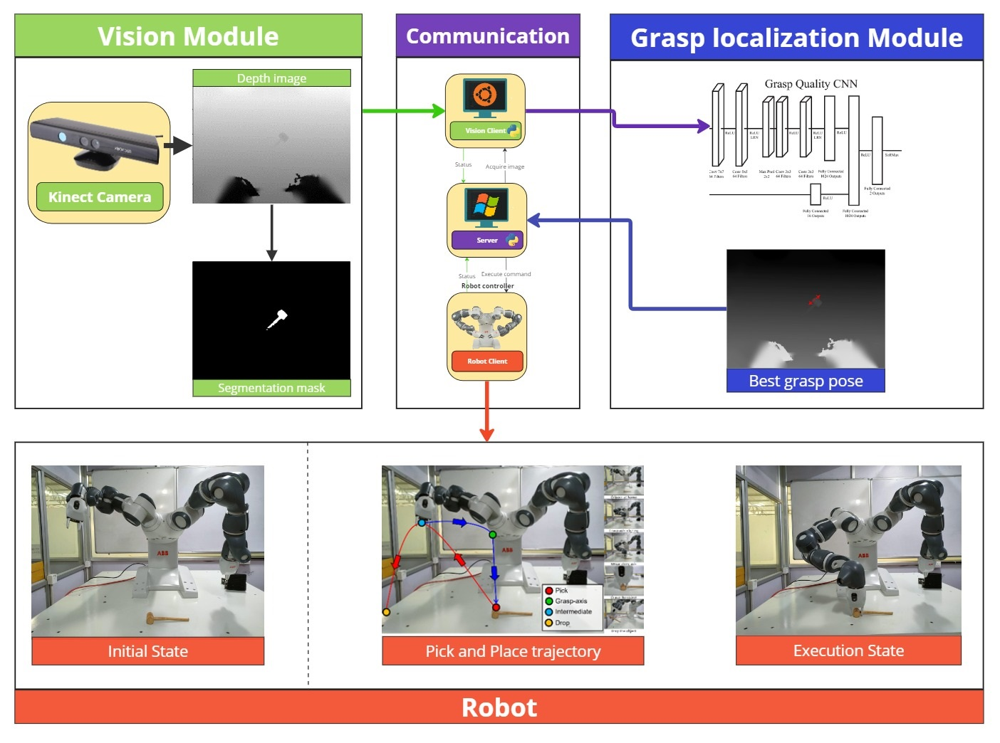

# **Development of Grasp localization system with deep learning aided vision system**
## B.Tech final project- SRM IST ' 2022

### **Contributors:** Jemuel Stanley Premkumar (jemprem@umich.edu), Harikrishnan Seetharaman (hariksee@umich.edu) and Gautham Ganesh Prasad

## **CONTENTS**
- [Introduction](#introduction)
- [Installation](#installation)
- [Report](/docs/Grasp_2022.pdf)

## **INTRODUCTION**
This B.Tech final project focuses on the development of a grasp localization system, employing state-of-the-art
methods namely GQ-CNN and ContactGraspNet for executing grasps on novel objects. The project centers on
the ABB YuMi Dual-arm Cobot, requiring the development of the entire system from its conceptualization.
Primary activities encompassed the establishment of seamless communication among the robot controller,
server, and the vision machine client. A critical aspect of the project involved configuring the vision system,
incorporating an overhead Kinect RGB-D camera, and addressing camera calibration and depth estimation
challenges.
The undertaken responsibilities predominantly revolved around robot control, vision system setup, and the
integration of all subsystems.<br>

**Keywords**: manipulation, grasp localization, robot control, computer vision



## **DEMO**


## **INSTALLATION STEPS**
<!-- To install DexNet 2.0, clone the repo from the <a href="">original website</a>. -->

### 1. Download installer setup for anaconda 5.2.0 which ships with Python version 3.6 :


Windows -  https://repo.continuum.io/archive/Anaconda3-5.2.0-Windows-x86_64.exe

Linux - https://repo.continuum.io/archive/Anaconda3-5.2.0-Linux-x86_64.sh

### 2. Download or clone the repository for the GQCNN version 1.3.0 (.zip,.tgz) from the link (https://github.com/BerkeleyAutomation/gqcnn/releases/tag/v1.3.0)
•	It is advised to have everything installed in (base) of the Anaconda package, however, a new environment can be created with python version 3.6.

### 3. Install Tensorflow-GPU or Tensorflow-CPU in the environment where you are planning to use GQCNN version 1.3.0
Tensorflow-CPU: tensorFlow-1.15.0 <br>
Tensorflow-GPU: tensorflow_gpu-1.15.0 , cuDNN = 7.4 , CUDA = 10

```sh
conda install tensorflow=1.15.0
```

It is advisable to use conda install as it takes care of dependencies in the activated environment.

•	Make the working directory to (gqcnn-1.3.0) as all the commands will be executed with this as a base folder. Run the command “pip install .”, to install gqcnn and other requirements to run the gqcnn package.

•	autolab-core, autolab-perception, visualization, numpy, opencv-python, scipy, matplotlib, tensorflow-gpu<=1.15.0, scikit-learn, scikit-image, gputil, psutil

•	Make sure the above-mentioned packages are installed as part of the pip installation before proceeding further.

•	The ROS dependencies require you to install the autolab-core package as a catkin package in the catkin workspace to utilize its functionality (If ROS is used in the project kindly look into ROS installation in gqcnn documentation)

•	The pre-trained model is tested for inference in Ubuntu 18.04.6 LTS (Bionic Beaver).

## MODIFICATIONS

### 1. TO RUN PRE-TRAINED GQCNN-4.0-PJ

•	Go to the directory ( gqcnn-1.3.0/scripts/downloads ) execute the command:
 ```
 chmod + x download_models.sh
 ```
 to enable access to run shell commands.

•	Run the shell file using the command 
```
sh download_models.sh
```
This should start the installation of pre-trained models inside a `model` directory with files including `GQCNN-2.0`, `GQCNN-2.1`, `GQCNN-3.0`, `GQCNN-4.0-PJ`, `GQCNN-4.0-SUCTION`, `FC-GQCNN-4.0-PJ`, `FC-GQCNN-4.0-SUCTION`.
•	Move the `scripts` folder which is present inside the `gqcnn-1.3.0` directory and paste it into the `examples` folder.

### 2. IN PYTHON SCRIPTS
•	Go to policy.py inside `gqcnn-1.3.0/examples` and change line 121-122 to the following:

```py
os.path.join(os.path.dirname(os.path.realpath(__file__)),
"scripts/downloads/models/models")
```
This is to set the model directory to your pre-trained model from which the configuration file, and checkpoints file will be loaded for your pre-trained model.

•	Make sure you have the following files in,
`gqcnn-1.3.1/examples/scripts/downloads/model/model/GQCNN-4.4-PJ`

1.	architecture.json
2.	checkpoint
3.	config.json
4.	im_mean.npy
5.	im_std.npy
6.	model.ckpt.data-00000-of-00001
7.	model.ckpt.index
8.	model.ckpt.meta
9.	pose_mean.npy
10.	pose_std.npy

•	These files are required to get inference from network_tf.py which is present in 
`gqcnn-1.3.0/gqcnn/model/tf`

•	Go to the python script network_tf.py and change line 42 to “import TensorFlow.train as tcf” , as the original contrib package is now deprecated and the functionality for (list_variables) is switched to train module.

•	Add the following lines at the start of the network_tf.py script to suppress all warnings during runtime of python policy,
```py
import warnings
warnings.filterwarnings(“ignore”)
```

•	Run the sample python policy as given in the documentation for the sample dataset present in `gqcnn-1.3.0/data/examples`

•	To execute the inference go-to base folder which is gqcnn-1.3.0 then run the following python policy in the command prompt as given below"

```sh
$ python examples/policy.py GQCNN-4.0-PJ --depth_image data/examples/clutter/phoxi/dex-net_4.0/depth_0.npy --segmask data/examples/clutter/phoxi/dex-net_4.0/segmask_0.png --camera_intr data/calib/phoxi/phoxi.intr
```

•	The policy can be modified to run inference for a single object as well by changing the depth image and segmask directory to the following,
`data/examples/single_object/primesense`

•	To view other grasp parameters add the following lines after line 255 of policy.py
```py
print("grasp pose details : {}".format(action.grasp.pose()))
print("Approach axis: {} , Approach      angle:{}".format(action.grasp.approach_axis,action.grasp.approach_angle))
print("Contact Points: {}".format(action.grasp.contact_points))
print("Width: {} , Width_px: {}".format(action.grasp.width,action.grasp.width_px))
print("Centre: {}".format(action.grasp.center))
print("Endpoints: {}".format(action.grasp.endpoints))
logger.info("Planning took %.3f sec" % (time.time() - policy_start))
```
•	The training dataset of size 8.0 GB can be downloaded for GQCNN-4.0-PJ (parallel jaw) using:
https://berkeley.app.box.com/s/6mnb2bzi5zfa7qpwyn7uq5atb7vbztng
